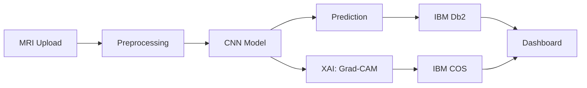

<div align="center">


[](https://youtu.be/JMZrROrt5qQ?si=V046ShjApX__89Iv)

# 🫀 AI‑Powered Heart MRI Classification

[](https://www.python.org/) [](https://flask.palletsprojects.com/) [](https://www.tensorflow.org/) [](https://www.ibm.com/cloud)

### 💎 **Enterprise AI for Global Cardiac Care: Explainable, Fast, Trusted**

> **🏆 IBM FINALIST** — Recognized for innovation in AI-powered clinical decision support

</div>

---

## 🌟 Why It Matters

**Transforming cardiac diagnostics with cutting-edge AI that delivers real-world clinical impact:**

- ⚡ **Faster Diagnosis** — Reduces MRI interpretation time from hours to seconds, enabling rapid clinical response
- 🔬 **Clinical Trust & Transparency** — Explainable AI (XAI) heatmaps provide visual evidence for every prediction, building physician confidence
- 🎯 **Automated Priority Triage** — Intelligent classification helps prioritize critical cases, optimizing workflow efficiency
- ☁️ **Scalable Cloud Infrastructure** — Built on IBM Cloud with enterprise-grade storage, database, and AI services for global deployment
- 🏅 **IBM Selection** — Validated by IBM as a finalist, demonstrating technical excellence and real-world applicability

---

## 💡 Innovation & WOW Factors

**What makes this project stand out from the crowd:**

### 🔥 **XAI Overlays: See What the AI Sees**

- **Grad-CAM & Integrated Gradients** generate pixel-level heatmaps showing exactly which anatomical regions influenced each prediction
- Transforms "black box" models into **transparent, trustworthy clinical tools**
- Enables radiologists to validate AI reasoning against their own expert analysis

### 🎨 **Advanced Multi-Class Classification**

- **4-class pathology detection:**
  - Normal
  - Myocardial Infarction
  - Dilated Cardiomyopathy (DCM)
  - Hypertrophic Cardiomyopathy (HCM)
- State-of-the-art CNN architecture (MobileNetV2 + custom layers) optimized for cardiac MRI
- Real-time inference: predictions in <2 seconds

### ☁️ **Production-Ready IBM Cloud Integration**

- **IBM Cloud Object Storage (COS):** Secure, scalable DICOM/MRI image storage
- **IBM Db2 on Cloud:** Relational database for patient metadata, case history, and audit trails
- **Watson Studio (optional):** Training pipeline for model retraining and continuous improvement
- **Multi-region deployment:** Designed for HIPAA compliance and low-latency global access

### 📊 **Interactive Clinical Dashboard**

- Real-time cohort analytics: confidence distributions, pathology prevalence, processing times
- Case management UI: filter by diagnosis, sort by confidence, search patient IDs
- Export reports for EMR/EHR integration

---

## 📸 Sample Results & Screenshots

### 🖼️ **Image Gallery**

<div align="center">

| 📤 MRI Upload Interface | 🧠 Prediction Output |
|:---:|:---:|
|  |  |
| *Upload MRI scans in DICOM or PNG/JPG format* | *Real-time classification with confidence scores* |

| 🔥 XAI Heatmap Visualization | 📊 Analytics Dashboard |
|:---:|:---:|
|  |  |
| *Grad-CAM heatmaps highlight diagnostic regions* | *Comprehensive cohort statistics and insights* |

| 📋 Case List Management |
|:---:|
|  |
| *Browse, filter, and export historical cases* |

</div>

---

## 🏗️ Architecture

### 📐 **System Schematic**


*End-to-end pipeline: Upload → Preprocessing → CNN Inference → XAI Generation → Storage → Dashboard*

### 🔄 **Technical Flow**



### 🧱 **Key Components**

1. **Frontend (Flask + Jinja2):**
   - Responsive web UI for upload, viewing, and dashboard
   - AJAX-based asynchronous processing for smooth UX

2. **Backend (Python + TensorFlow):**
   - MobileNetV2 base + custom dense layers
   - Grad-CAM / Integrated Gradients for XAI
   - Image preprocessing pipeline (resize, normalize, augment)

3. **Storage (IBM Cloud):**
   - **Object Storage:** DICOM/image files
   - **Db2:** Case metadata, predictions, timestamps

4. **Model Training:**
   - Dataset: Curated cardiac MRI dataset (details in `notebooks/`)
   - Augmentation: rotation, zoom, brightness, contrast
   - Metrics: accuracy, precision, recall, F1, AUC-ROC

---

## 🚀 Quick Start

### 📋 Prerequisites

- Python 3.9+
- IBM Cloud account (for COS & Db2)
- TensorFlow 2.x
- Flask 2.x

### 🔧 Installation

1) **Clone the repository:**

```bash
git clone https://github.com/Darkwebnew/AI-Powered-Heart-MRI-Classification-for-Clinical-Decision-Support.git
cd AI-Powered-Heart-MRI-Classification-for-Clinical-Decision-Support
```

2) **Install dependencies:**

```bash
pip install -r requirements.txt
```

3) **Configure environment** (examples in `.env.example`):
   - `IBM_COS_BUCKET`, `IBM_COS_APIKEY`, `IBM_COS_ENDPOINT`
   - `DB2_DSN` / credentials

4) **Launch the application:**

```bash
python app.py
# or
flask run --host 0.0.0.0 --port 8080
```

---

## 👩‍⚕️ Usage

- **Upload MRI/DICOM** → view prediction + XAI heatmap
- **Save case:** metadata stored in Db2; images to Object Storage
- **Monitor dashboard:** cohort stats, model confidence distribution

---

## 🧭 Repository Structure

```
.
├── app.py                      # Main Flask application
├── models/                     # Trained model files
├── notebooks/                  # Jupyter notebooks for experiments
├── static/ | templates/        # Frontend assets
├── docs/
│   └── images/
│       ├── heatmap.png
│       ├── mri_example.png
│       └── dashboard.png
└── README.md
```

---

## 👩‍💻 Authors & Contributors

- **SRIRAM V** — [GitHub profile](https://github.com/)
- **SHIVRAJ R G** — [GitHub profile](https://github.com/)
- **M MADHURI G** — [GitHub profile](https://github.com/)
- **DARSHANI** — [GitHub profile](https://github.com/)

*If you share GitHub usernames, we'll update these links to point directly to your profiles.*

---

## 🙏 Acknowledgments

- **IBM Cloud** and the IBM Academic/Startup programs for credits, tooling, and guidance
- **Open-source community:** TensorFlow, Flask, and visualization libraries

---

## 📜 License

This project is intended for **research and educational use**. For clinical deployment, ensure regulatory compliance and validation.

---

<div align="center">

**Made with ❤️ for advancing global cardiac care through explainable AI**

</div>
